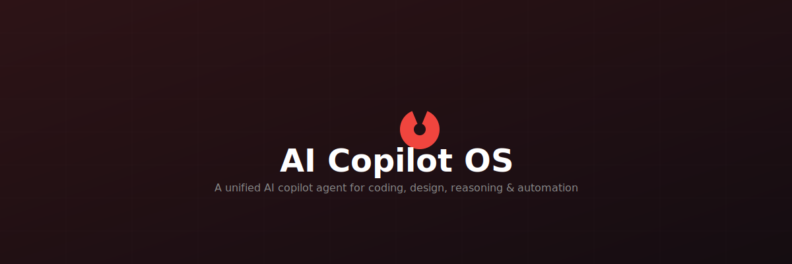

# ⎔ AI Copilot OS

> A fully open-source AI copilot agent — one system that unifies coding, design, reasoning, and automation into a single self-improving workflow.

[](#license)
[](#about)
[]()
[]()
[]()
[]()
[](#-api-access)
[]()

---

AI Copilot OS is a browser-based AI engineering assistant that connects to **5 providers and 10 models** through a single chat interface. It can write and execute code, search the web, fetch URLs, automate GitHub, generate websites and visual designs, run multi-step agent tasks with fallback, and remember context across sessions — all from a unified dashboard.

Built entirely with TypeScript on Next.js, it runs in your browser with your own API keys (or free hosted access to select models) and stores data locally or optionally in Supabase.

---

## ✦ Features

| Area | What's built |
|------|-------------|
| **Multi-Provider AI** | 5 providers — **Groq**, **Mistral**, **OpenRouter**, **NVIDIA**, **Cloudflare** — 10 total models. Automatic fallback on failure. Tier-based routing (fast / balanced / thorough) by task intent. |
| **Agent Loop** | Multi-turn tool-using agent with web search, URL fetching, GitHub API, code execution, memory search, and URL safety checking. Fallback chain across all providers. |
| **Code Execution** | JavaScript sandbox with security inspection, output truncation, timeout controls, and blocked-command detection. |
| **Website Builder** | Generates production-quality single-file websites (HTML/CSS/JS) from a natural language description. |
| **Image Studio** | Generates and edits visual designs as HTML/SVG through the agent loop. |
| **Game Builder** | Generates playable HTML/JS games from a description. |
| **Web Search** | Real-time web search via Tavily API with configurable depth, result count, and answer extraction. |
| **Memory System** | Short-term and long-term memory with search. Local storage + optional Supabase sync. |
| **Model Context Protocol (MCP)** | Connect external AI tools and endpoints through the MCP standard. |
| **Connectors & Plugins** | Extend functionality via external service connectors and a plugin system. |
| **API Center** | Manage API keys and endpoints across all providers from one dashboard. |
| **Dashboard** | System overview with provider health monitoring, telemetry, and activity metrics. |
| **Auth & Sync** | Email/password authentication with optional Supabase cloud sync. |

---

## ✦ API Access

This project supports two modes so you can start building immediately:

**Free hosted access** — select providers have free-tier models configured out of the box (Groq, NVIDIA, Cloudflare). Just enter your own API keys from their free tiers and start using them. Usage limits are determined by each provider's free-tier policy.

**Bring your own key (BYOK)** — add API keys for any supported provider in the Settings page or `.env.local` to unlock all models. This bypasses any free-tier limitations and uses your own quota/billing directly.

> No rate-limiting logic is enforced at the application level — each provider handles its own rate limits and quotas.

---

## ✦ Benchmarks

Results from `scripts/benchmark.mjs` — 3 non-streaming runs per model, short factual prompt ("What is 2+2? Reply with only the number."), measured on 2026-07-18.

| Provider | Model | Avg Latency | Success Rate |
|----------|-------|-------------|:------------:|
| **Groq** | `llama-3.3-70b-versatile` | 0.40s | 3/3 |
| **Groq** | `llama-3.1-8b-instant` | **0.13s** | 3/3 |
| **Mistral** | `mistral-medium` | 0.61s | 3/3 |
| **Mistral** | `mistral-small` | 0.83s | 3/3 |
| **OpenRouter** | `openai/gpt-4o` | 1.04s | 3/3 |
| **OpenRouter** | `meta-llama/llama-3.3-70b-instruct` | 0.69s | 3/3 |
| **NVIDIA** | `nvidia/nemotron-3-ultra-550b-a55b` | 2.74s | 3/3 |
| **NVIDIA** | `deepseek-ai/deepseek-v4-flash` | 2.33s | 3/3 |
| **Cloudflare** | `@cf/meta/llama-3.1-8b-instruct` | 0.69s | 3/3 |
| **Cloudflare** | `@cf/mistral/mistral-7b-instruct-v0.1` | 1.32s | 3/3 |

**Agent-loop task completion:** 8/10 on a set of factual, coding, and reasoning tasks.

**What these numbers measure:** raw non-streaming API latency for each provider/model (short prompt, single concurrent request).  
**What they don't measure:** streaming TTFT, response quality beyond simple factual checks, performance under load, long-context performance, time-of-day variation, or real-world multi-step agent interactions. These are a single-session snapshot — real-world performance varies by network conditions, provider-side load, prompt length, and concurrency.

---

## ✦ Quick Start

```bash
# 1. Clone
git clone https://github.com/rishavjha/ai-copilot-os.git
cd ai-copilot-os

# 2. Install dependencies
npm install

# 3. Copy environment file and add your API keys
cp .env.example .env.local
# Edit .env.local — at minimum set GROQ_API_KEY for chat, or use any provider you prefer

# 4. Run the development server
npm run dev
```

Open [http://localhost:3000](http://localhost:3000) in your browser. No database or external services required — the app stores data locally by default.

Required env vars (at least one provider key):
- `GROQ_API_KEY` — free at https://console.groq.com/keys
- `MISTRAL_API_KEY` — https://console.mistral.ai/api-keys/
- `OPENROUTER_API_KEY` — https://openrouter.ai/keys
- `NVIDIA_API_KEY` — https://build.nvidia.com/
- `CLOUDFLARE_API_TOKEN` + `CLOUDFLARE_ACCOUNT_ID` — https://dash.cloudflare.com/profile/api-tokens

---

## ✦ How It Differs

| This project | Most coding copilots |
|--------------|---------------------|
| 5 providers, 10 models, BYOK | Tied to a single provider |
| Browser-based, zero install | IDE plugin or CLI only |
| Agent loop with tool use + fallback | Single-turn Q&A or basic chat |
| Self-hosted, open source | Proprietary SaaS or closed models |
| Generates websites, games, images from prompts | Code completion / diff only |

No superiority claims here — just different tradeoffs. This project prioritizes provider flexibility, open-source transparency, and breadth of capabilities over depth in any single area.

---

## ✦ About

Built solo by **Rishav Jha**, a +2 (higher secondary) student from Nepal, with the help of AI coding tools and self-taught design/creative skills. This is an independent, early-stage open-source project — contributions, feedback, and issue reports are welcome.

---

## ✦ License

This project is licensed under the **MIT License** — see the [LICENSE](LICENSE) file for details.

> **Docs and community Discord coming soon.** For now, open an issue or reach out directly.

---

<p align="center">
  <sub>Built with Next.js · TypeScript · Tailwind CSS · Supabase · Framer Motion · Three.js</sub>
</p>
